<div align="center">

# 🎓 Intelligent Depression Risk Prediction for University Student Wellbeing
### A Full-Stack Data Science Approach Integrating Statistical Modelling, Machine Learning and AI Automation

[](https://www.python.org/)
[](https://pandas.pydata.org/)
[](https://numpy.org/)
[](https://scikit-learn.org/)
[](https://shap.readthedocs.io/)
[](https://www.microsoft.com/sql-server)
[](https://www.microsoft.com/excel)
[](https://powerbi.microsoft.com/)
[](https://streamlit.io/)
[](https://www.docker.com/)
[](https://git-scm.com/)

*An end-to-end analytics and machine learning solution helping universities identify at-risk students early, allocate wellbeing resources intelligently, and drive evidence-based mental health strategy.*

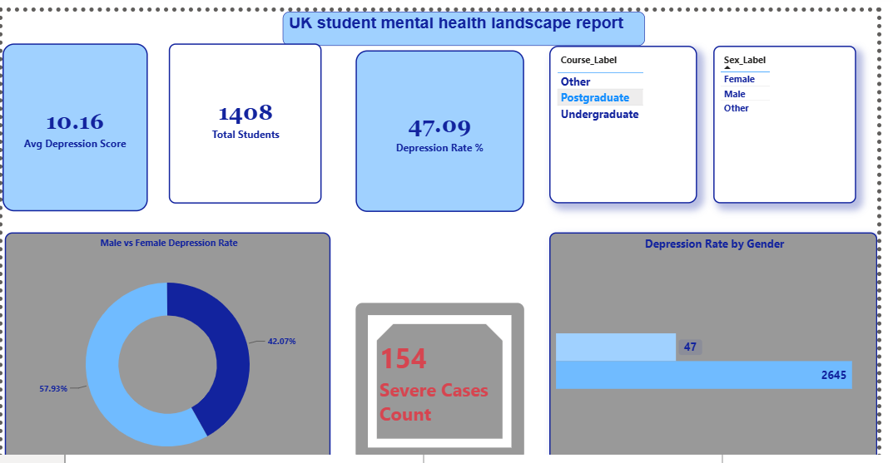

</div>

---

## 📑 Table of Contents

1. [Executive Summary](#-executive-summary)
2. [Project Overview](#-project-overview)
3. [Problem Statement](#-problem-statement)
4. [Objectives](#-objectives)
5. [Business Problem](#-business-problem)
6. [Why This Project Matters](#-why-this-project-matters)
7. [Dataset Description](#-dataset-description)
8. [Technology Stack](#-technology-stack)
9. [Project Architecture](#-project-architecture)
10. [Data Cleaning](#-data-cleaning)
11. [Exploratory Data Analysis](#-exploratory-data-analysis)
12. [Statistical Analysis](#-statistical-analysis)
13. [SQL Analysis](#-sql-analysis)
14. [Excel Analysis](#-excel-analysis)
15. [Feature Engineering](#-feature-engineering)
16. [Machine Learning Pipeline](#-machine-learning-pipeline)
17. [Model Evaluation](#-model-evaluation)
18. [Explainable AI](#-explainable-ai-shap)
19. [Power BI Dashboard](#-power-bi-dashboard)
20. [Advanced DAX & Business Intelligence](#-advanced-dax--business-intelligence)
21. [Deployment](#-deployment)
22. [Business Insights](#-business-insights)
23. [Recommendations](#-recommendations)
24. [Challenges Faced](#-challenges-faced)
25. [Future Improvements](#-future-improvements)
26. [Business Value](#-business-value)
27. [Real-World Applications](#-real-world-applications)
28. [Recruiter Highlights](#-recruiter-highlights)
29. [Key Achievements](#-key-achievements)
30. [Lessons Learned](#-lessons-learned)
31. [Conclusion](#-conclusion)
32. [Project Screenshots & Visual Showcase](#-project-screenshots--visual-showcase)
33. [Source Documentation & Citations](#-source-documentation--citations)
34. [References](#-references)

---

## 🧭 Executive Summary

> **In one sentence:** This project builds a complete, production-grade analytics and machine learning pipeline that identifies university students at risk of depression using validated psychological screening instruments — turning raw survey data into SQL insight, Excel-engineered features, an explainable ML model, an executive Power BI dashboard, and a deployed web application.

Analysing **1,408 UK university students**, the project found that **47.09% screened positive for clinically significant depression (PHQ-9 ≥ 10)**, with **154 students in the severe category**. A Gradient Boosting classifier achieved **86.9%–93.0% ROC-AUC**, with anxiety (GAD-7), stress (PSS), and loneliness (UCLA-3) emerging as the leading predictive drivers — findings validated through SHAP explainability and cross-checked against 19 independent SQL queries and an executive Power BI dashboard suite.

The solution demonstrates a complete **Full-Stack Data Science lifecycle**: SQL analytics → Excel data engineering → Python/ML modelling → Explainable AI → Power BI executive reporting → Docker containerisation → cloud-ready Streamlit deployment.

---

## 🎯 Project Overview

University students face disproportionately high rates of depression, anxiety, and psychological distress compared to the general population, driven by academic pressure, social isolation, financial stress, and the transition to independent living. Most institutions rely on **reactive, self-referral counselling models** — meaning at-risk students are often identified only after a crisis point.

This project reframes early mental health screening as a **data science problem**: using validated psychometric instruments (PHQ-9, GAD-7, PSS, UCLA-3, SBQ, MDQ, P16) already collected by universities, a predictive model flags at-risk students proactively, while SQL and Power BI layers give university welfare teams an executive-level view of institutional mental health trends.

| Attribute | Detail |
|---|---|
| **Domain** | Healthcare Analytics / EdTech / Applied Machine Learning |
| **Population** | 1,408 UK university students |
| **Target variable** | `Depression_Flag` (PHQ-9 ≥ 10) |
| **Best model** | Gradient Boosting Classifier (ROC-AUC 0.930) |
| **Deployment** | Dockerized Streamlit app |
| **Reporting layer** | 3-page executive Power BI dashboard |

---

## ❓ Problem Statement

Universities collect large volumes of student wellbeing data through psychological screening tools, but this data is typically **siloed, underused, and analysed manually** — if analysed at all. There is no systematic, data-driven mechanism to:

- Flag students at elevated depression risk before a crisis occurs
- Quantify institutional and demographic patterns in mental health outcomes
- Give welfare managers an executive dashboard for resource planning
- Explain *why* a given student is flagged, in a clinically trustworthy way

This project directly addresses that gap.

---

## 🎯 Objectives

- Build a clean, analysis-ready dataset from raw psychometric survey data
- Answer 19 SQL-based diagnostic questions covering prevalence, demographics, and risk stratification
- Engineer clinically meaningful features in Excel (severity bands, NHS-aligned recommendations)
- Train, evaluate, and explain a machine learning model that predicts depression risk
- Build an interactive, decision-ready Power BI dashboard for non-technical stakeholders
- Deploy the model as a live, containerised web application
- Translate every analytical output into a business, healthcare, and institutional recommendation

---

## 💼 Business Problem

From a university's perspective, mental health incidents translate directly into **operational and financial risk**: increased dropout rates, extended time-to-degree, reputational risk, and rising demand on already-stretched counselling services. Without predictive insight, wellbeing budgets are spent reactively rather than strategically.

> **💡 Business Insight:** A 10-percentage-point reduction in undetected high-risk cases can materially reduce crisis-driven counselling demand and improve student retention — both of which carry direct financial value to an institution (tuition retention, funding metrics, NSS satisfaction scores).

---

## 🌍 Why This Project Matters

- **For students** — earlier support, before symptoms escalate to crisis level
- **For universities** — data-driven resource allocation instead of reactive triage
- **For the NHS and public health system** — reduced downstream burden on emergency mental health services
- **For the data science profession** — a case study in responsible, explainable AI applied to a sensitive, high-stakes healthcare context

---

## 🗂 Dataset Description

The dataset comprises **1,408 university students** who completed a battery of standardized, validated psychological screening instruments.

> **📚 Dataset Citation:** Akram, U. et al. (2023). *UK University Student Mental Health* [Dataset]. **Nature Scientific Data.** N = 1,408 UK university students. All demographic, institutional, and psychometric fields in this project derive from this published dataset — see [References](#-references) for the full citation.

| Column | Instrument | Description |
|---|---|---|
| `Age` | — | Student age (decimal) |
| `Sex` | — | 1 = Male, 2 = Female, Other |
| `Course_Type` | — | 1 = Undergraduate, 2 = Postgraduate |
| `Institution` | — | Encoded institution ID |
| `PHQ9_Depression` | **PHQ-9** | Patient Health Questionnaire — depression severity (0–27) |
| `GAD7_Anxiety` | **GAD-7** | Generalized Anxiety Disorder scale (0–21) |
| `PSS_Stress` | **PSS** | Perceived Stress Scale |
| `SCI_Insomnia` | **SCI** | Sleep Condition Indicator |
| `UCLA3_Loneliness` | **UCLA-3** | Loneliness Scale |
| `SBQ_Suicidal_Ideation` | **SBQ** | Suicidal Behaviours Questionnaire |
| `MDQ_Mania` | **MDQ** | Mood Disorder Questionnaire |
| `P16_Psychotic_Exp_Sum` | **P16** | Psychotic Experiences Screener |

**Target variable:** `Depression_Flag` — derived as `PHQ9_Depression ≥ 10` (clinically validated threshold for at least moderate depression).

| Metric | Value |
|---|---|
| Total students (full dataset) | **1,408** |
| Training subset | **1,126** (≈80% stratified split) |
| Test subset | **281** (≈20% stratified split — used for all evaluation metrics reported below) |
| Depressed (PHQ-9 ≥ 10) | 663 (**47.1%**) |
| Not Depressed | 745 (52.9%) |
| Severe cases (PHQ-9 ≥ 20) | **154** |
| Average Depression Score | 10.16 |

> **📌 Reporting Note:** Some intermediate notebook outputs reference **N = 1,126** — this is the *training* subset only, produced by an 80/20 stratified split of the full N = 1,408 dataset. The 281-record test set (149 Not Depressed + 132 Depressed) is what all accuracy, precision, recall, F1, and ROC-AUC figures in [Model Evaluation](#-model-evaluation) are calculated against. This distinction is stated explicitly here to avoid any ambiguity between "records analysed" and "records the model was trained on."

> **⚠️ Clinical Note:** PHQ-9 and GAD-7 are internationally validated, NHS-recommended screening tools — not diagnostic instruments. All model outputs in this project are framed as **risk-flagging**, not clinical diagnosis, and are intended to trigger human-led follow-up, never to replace it.

### 📋 Questionnaire & Scoring Reference

The model's input features come from validated mental health screening instruments. This project does **not** reproduce the exact question wording of these instruments — most are copyrighted by their original authors/publishers. Use the official versions linked below for any real data-collection form, and cite them accordingly.

| Feature | Instrument | What it measures | Typical range | Official source |
|---|---|---|---|---|
| `PHQ9_Depression` | PHQ-9 (Patient Health Questionnaire) | Depression severity, 9 items | 0–27 | Pfizer / [phqscreeners.com](https://www.phqscreeners.com) |
| `GAD7_Anxiety` | GAD-7 (Generalized Anxiety Disorder scale) | Anxiety severity, 7 items | 0–21 | Pfizer / [phqscreeners.com](https://www.phqscreeners.com) |
| `PSS_Stress` | PSS (Perceived Stress Scale) | Perceived stress, 10-item version | 0–40 | Cohen, Kamarck & Mermelstein (1983) |
| `SCI_Insomnia` | SCI (Sleep Condition Indicator) | Insomnia symptoms | 0–28 | Espie et al. (2014) |
| `UCLA3_Loneliness` | UCLA-3 (3-item Loneliness Scale) | Loneliness | 3–9 | Hughes et al. (2004) |
| `SBQ_Suicidal_Ideation` | SBQ-R (Suicidal Behaviors Questionnaire) | Suicidal ideation/behaviour risk | 0–18 | Osman et al. (2001) |
| `P16_Psychotic_Exp_Sum` | PQ-16 / P16 | Psychotic-like experiences | 0–16 | Ising et al. (2012) |
| `MDQ_Mania` | MDQ (Mood Disorder Questionnaire) | Mania/hypomania screening | 0–13 | Hirschfeld et al. (2000) |
| `Age` | — | Participant age (years) | Numeric | — |
| `Institution` | — | Institution code as encoded in the source dataset | Categorical | Akram et al. (2023) |
| `Sex` | — | Sex as encoded in the source dataset | Categorical | Akram et al. (2023) |
| `Course_Type` | — | Course/programme type code | Categorical | Akram et al. (2023) |

> **📌 Implementation Note:** The exact scoring, item wording, and administration instructions for each clinical instrument should be obtained from the official source before deploying this to real users — do not write a custom version of the questions. For `Institution`, `Sex`, and `Course_Type`, use the exact categorical encoding scheme from the Akram et al. (2023) dataset documentation so that any new input maps correctly to what the model was trained on.

> **🚨 Ethical & Clinical Safeguarding:** Several of these instruments — particularly the **PHQ-9** and **SBQ-R** — touch directly on suicidal ideation. If this application is ever used with real students, it must sit behind appropriate safeguarding protocols: a visible crisis-support resource on every screen, and a clear, mandatory hand-off pathway to a human counsellor for anyone flagged as high-risk. This tool is designed to be a **triage aid for trained staff**, not a standalone, unsupervised, self-diagnosis product.

---

## 🛠 Technology Stack

| Layer | Tools |
|---|---|
| **Database & Analytics** | SQL Server (T-SQL), Microsoft Excel, Power Query |
| **Data Science / ML** | Python, Pandas, NumPy, Scikit-Learn, SHAP, Matplotlib |
| **Explainability** | SHAP (SHapley Additive exPlanations) |
| **Web Application** | Streamlit, Python |
| **Business Intelligence** | Power BI, Power Query, DAX |
| **DevOps / Deployment** | Git, GitHub, Docker, Streamlit |
| **AI-Assisted Engineering** | Claude AI, OpenCode, Antigravity |

---

## 🏗 Project Architecture

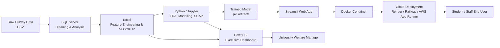

**Pipeline stages:**
1. **Ingestion** — raw CSV loaded into SQL Server with `TRY_CAST` type coercion
2. **SQL Analytics** — 19 diagnostic business/clinical questions answered
3. **Excel Engineering** — severity bands, VLOOKUP labels, NHS recommendations
4. **Python Modelling** — EDA → preprocessing → training → evaluation → SHAP
5. **Power BI** — 3-page executive reporting suite
6. **Deployment** — Streamlit app containerised with Docker, ready for cloud deployment (Render, Railway, or AWS App Runner)

---

## 🧹 Data Cleaning

Raw survey exports arrived as loosely typed CSV data (all columns imported as `VARCHAR`), requiring a structured cleaning phase in both SQL and Excel:

- **Type coercion** — used `TRY_CAST()` in SQL Server to safely convert text fields to `DECIMAL`/`INT`, silently nulling invalid entries rather than crashing the load (visible in the `uk_student_mh` table build script)
- **Missing value detection** — 2 missing `SBQ_Suicidal_Ideation` values and 1 missing `P16_Psychotic_Exp_Sum` / `Age` value identified and profiled (see correlation matrix header output)
- **Invalid category handling** — 91 students had `Course_Type` values outside the valid {1, 2} set, isolated with a dedicated data-quality query rather than silently dropped
- **Standardisation** — categorical codes (`Sex`, `Course_Type`) mapped consistently across SQL, Excel, and Power BI via shared label logic

> **💡 Why this matters:** In healthcare-adjacent data, silent type coercion errors or dropped rows can systematically bias risk estimates. Using `TRY_CAST` plus explicit missing-value auditing keeps the cleaning process transparent and reproducible.

---

## 📊 Exploratory Data Analysis

EDA was performed in Python (Pandas, Matplotlib) to understand distribution shape, class balance, and inter-variable relationships before modelling.

**PHQ-9 Distribution & Class Balance**

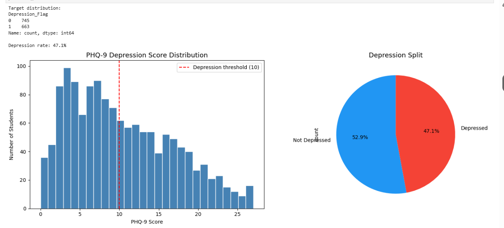

The depression score distribution is right-skewed with a visible mass around the clinical threshold of 10, confirming a genuinely mixed (not artificially imbalanced) population: **52.9% Not Depressed vs 47.1% Depressed** — a healthy near-balanced split for classification.

**Correlation Matrix — Mental Health Scores**

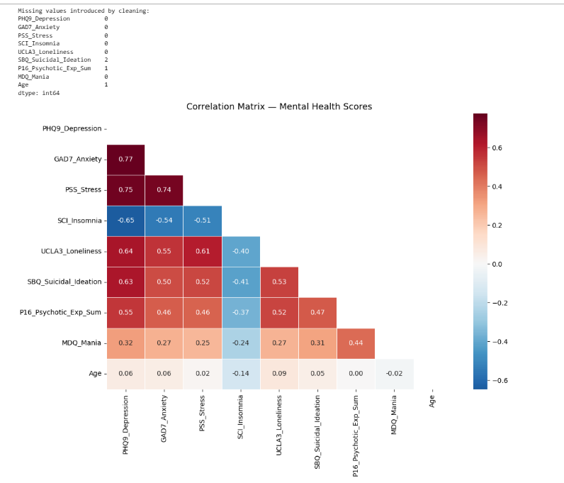

| Variable pair | Correlation with PHQ-9 Depression |
|---|---|
| GAD7_Anxiety | **+0.77** (strongest positive driver) |
| PSS_Stress | +0.75 |
| UCLA3_Loneliness | +0.64 |
| SBQ_Suicidal_Ideation | +0.63 |
| P16_Psychotic_Exp_Sum | +0.55 |
| MDQ_Mania | +0.32 |
| SCI_Insomnia | **−0.65** (inverse — lower sleep quality score = worse insomnia) |
| Age | +0.06 (negligible) |

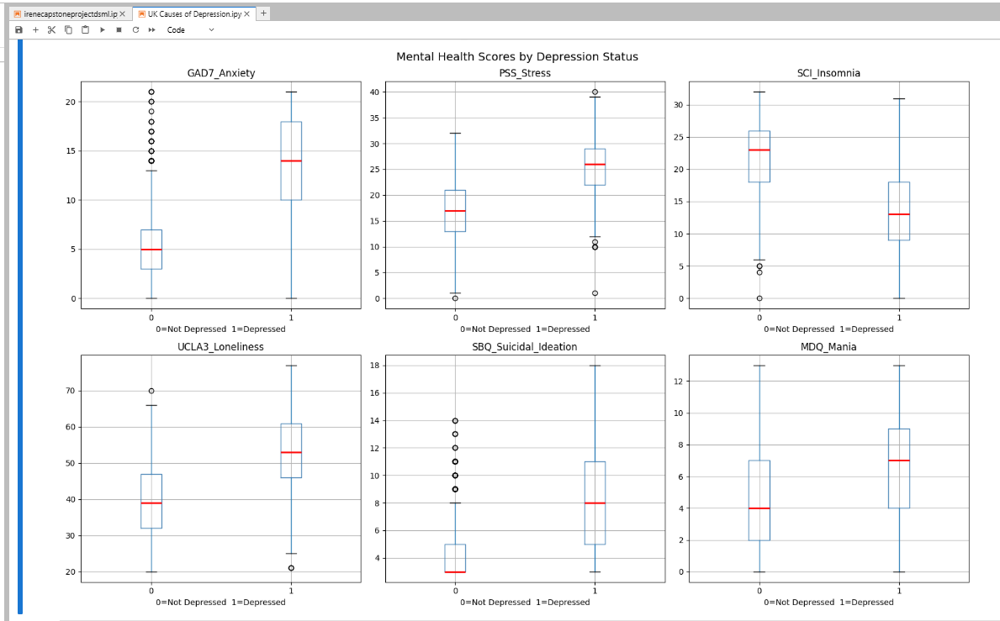

**Boxplots by Depression Status** confirm the same signal visually: students flagged as depressed show markedly higher median Anxiety, Stress, Loneliness, and Suicidal Ideation scores, and markedly lower (worse) Insomnia/sleep-quality scores, with numerous high-severity outliers in the depressed group.

> **🩺 Healthcare Insight:** The strong co-occurrence of anxiety, stress, and loneliness with depression mirrors established clinical literature on comorbid internalising disorders — reinforcing that screening tools should rarely be interpreted in isolation.

---

## 📈 Statistical Analysis

- **Descriptive statistics** (mean, min/max, standard deviation) computed for every psychometric scale in SQL and Python
- **Correlation analysis** identified anxiety, stress, and loneliness as the strongest linear correlates of depression
- **Group comparisons** (gender, institution, course type, age band) computed via SQL `GROUP BY` aggregation and validated in Power BI
- **Risk scoring** — a composite, clinically weighted `Risk_Score` was engineered in SQL (weighting suicidal ideation and anxiety most heavily) and banded into CRITICAL / HIGH / MEDIUM / LOW tiers

---

## 🗄 SQL Analysis

All SQL analysis was performed in **Microsoft SQL Server (T-SQL)** against the cleaned `depression_clean` / `uk_student_mh` tables, using `TRY_CAST`, `CASE WHEN` bucketing, `GROUP BY` aggregation, `CTEs`, and `LEFT JOIN` logic. 19 business/clinical questions were answered:

| # | Question | Key Finding |
|---|---|---|
| Q1 | Dataset structure preview | 12 columns, 1,408 rows |
| Q2 | Total number of students | **1,408** |
| Q3 | Age range of students | Min/Max/Avg age profiled |
| Q4 | Gender distribution | Male vs Female vs Other, with % share |
| Q5 | Undergraduate vs Postgraduate split | Course-type breakdown |
| Q6 | Depression prevalence (PHQ-9 ≥ 10) | **663 depressed (47.1%)** |
| Q7 | Depression severity breakdown | 5-tier clinical banding (Minimal → Severe) |
| Q8 | Average scores across all scales | Depression, Anxiety, Stress, Insomnia, Loneliness, Suicidal Ideation, Mania |
| Q9 | Depression rate by gender | Gender-stratified prevalence & counts |
| Q10 | Average scores by gender | Cross-scale gender comparison |
| Q11 | Severity breakdown by gender | Gender × severity cross-tab |
| Q12 | Highest-depression institution | Institution ranked by avg PHQ-9 |
| Q13 | Institution with most severe cases | Severe-case count by institution |
| Q14 | Postgraduate vs undergraduate depression | Course-type comparison + null-value audit (91 invalid records) |
| Q15 | Students at critical mental health risk | Composite weighted `Risk_Score` → CRITICAL/HIGH/MEDIUM/LOW |
| Q16 | Severe depression + high suicidal ideation | Highest-priority intervention list (Top 20) |
| Q17 | Loneliness vs depression relationship | 4-band loneliness segmentation |
| Q18 | Highest-risk age group | Age-banded depression rate |
| Q19 | Students needing urgent support | `support_services` lookup table joined to risk tiers |

**Example — Q15 (Composite Risk Scoring):**

```sql
WITH RiskScored AS (
    SELECT *,
        (CASE WHEN TRY_CAST(GAD7_Anxiety AS FLOAT) >= 15 THEN 3 ELSE 0 END
       + CASE WHEN TRY_CAST(PSS_Stress AS FLOAT) >= 30 THEN 2 ELSE 0 END
       + CASE WHEN TRY_CAST(SCI_Insomnia AS FLOAT) <= 10 THEN 2 ELSE 0 END
       + CASE WHEN TRY_CAST(UCLA3_Loneliness AS FLOAT) >= 55 THEN 2 ELSE 0 END
       + CASE WHEN TRY_CAST(SBQ_Suicidal_Ideation AS FLOAT) >= 8 THEN 3 ELSE 0 END
       + CASE WHEN TRY_CAST(P16_Psychotic_Exp_Sum AS FLOAT) >= 6 THEN 1 ELSE 0 END) AS Risk_Score
    FROM depression_clean
)
SELECT
    CASE WHEN Risk_Score >= 8 THEN 'CRITICAL'
         WHEN Risk_Score >= 5 THEN 'HIGH'
         WHEN Risk_Score >= 3 THEN 'MEDIUM'
         ELSE 'LOW' END AS Risk_Level,
    COUNT(*) AS Students
FROM RiskScored
GROUP BY ...
```

- **SQL logic:** clinically weighted composite scoring, where suicidal ideation and severe anxiety carry the highest weight, mirrors real triage protocols
- **Healthcare importance:** enables tiered response (same-day referral for CRITICAL vs self-directed resources for LOW)
- **Business importance:** converts raw scores into an operational triage queue counselling teams can act on directly
- **Decision-making value:** removes subjectivity from prioritisation — every student is scored on the same rubric
- **University application:** feeds directly into the `support_services` referral table (Q19), automating the hand-off from data to action

> **💡 Recommendation:** This SQL risk-tiering logic could be scheduled as a nightly stored procedure, automatically refreshing the welfare team's priority queue each morning.

---

## 📗 Excel Analysis

Excel was used as the **feature engineering and validation layer**, sitting between raw SQL exports and the Python/Power BI stages — a deliberate choice, since Excel remains the tool most familiar to non-technical university welfare staff who need to audit the data themselves.

| Engineered Column | Logic | Purpose |
|---|---|---|
| `Depression_Flag` | `IF(PHQ9_Depression>=10,1,0)` | Binary ML target variable |
| `Depression_Severity` | Nested `IF` bands (Minimal/Mild/Moderate/Mod-Severe/Severe) | Clinical PHQ-9 severity classification |
| `Age_Group` | Nested `IF` bands (Under 20 → 35+) | Demographic segmentation for reporting |
| `Sex_Label` | `VLOOKUP` against a Sex code lookup table | Human-readable labels for dashboards |
| `Severity_Label` | `VLOOKUP` against severity code table | Consistent labels across Excel/Power BI |
| `NHS_Recommendation` | `VLOOKUP` mapping severity → NHS-aligned guidance text | Actionable next-step for each severity tier |

**Why each feature matters:**
- **Analytical importance** — pre-computed bands remove repeated logic from every downstream query/report, ensuring one single source of truth for severity definitions
- **Healthcare importance** — the `NHS_Recommendation` column operationalises NHS stepped-care guidance (self-help → counselling → urgent referral) directly against the data
- **Business significance** — non-technical stakeholders (welfare managers, department heads) can filter and pivot on these labels without needing SQL or Python access
- **Why Excel remains important** — despite advanced tooling further downstream, Excel is still the *fastest, most auditable* way to validate engineered logic before it is trusted in a production model or dashboard; it also remains the primary interchange format most university administrative teams can open, edit, and sign off on

---

## 🔧 Feature Engineering

Beyond the Excel-layer features, the Python pipeline engineered the final modelling feature set:

- **Target leakage prevention** — `PHQ9_Depression` itself was **excluded from the model's feature set**, since it was used to construct the target label (`Depression_Flag`); including it would let the model trivially "predict" the label from its own definition rather than learning genuine risk relationships
- **Final feature set:** `Age`, `Sex`, `Course_Type`, `Institution`, `SCI_Insomnia`, `GAD7_Anxiety`, `PSS_Stress`, `MDQ_Mania`, `SBQ_Suicidal_Ideation`, `P16_Psychotic_Exp_Sum`, `UCLA3_Loneliness`
- **Encoding** — categorical fields (`Sex`, `Course_Type`, `Institution`) retained as integer-encoded categories consistent with the SQL schema
- **Scaling** — continuous features standardised via `StandardScaler` (fit on training data only, then applied to test data) to ensure fair coefficient weighting for scale-sensitive models like Logistic Regression and SVM

> **⚠️ Data Leakage Note:** Excluding the source variable of the target label is one of the most important — and most commonly overlooked — steps in healthcare ML pipelines. It was deliberately called out in the notebook to demonstrate methodological rigor.

---

## 🤖 Machine Learning Pipeline

**Workflow:** `Data Loading → Cleaning → EDA → Feature Engineering → Train/Test Split → Scaling → Model Training → Evaluation → SHAP Explainability → Model Persistence → Deployment Prep`

| Step | Implementation | Why it matters |
|---|---|---|
| **Preprocessing** | Missing value audit, type casting, leakage-safe feature selection | Prevents silently biased or invalid model input |
| **Train/Test Split** | Stratified split preserving class balance | Ensures both sets reflect the true ~47/53 depression split |
| **Scaling** | `StandardScaler` fit on train, applied to test | Required for distance/gradient-sensitive models (Logistic Regression, SVM) |
| **Feature Engineering** | Leakage-safe predictor set (11 features) | Produces a model that generalises to *new, unlabelled* students |
| **Model Selection** | 5 algorithms benchmarked head-to-head | Avoids premature commitment to a single algorithm family |
| **Evaluation** | Accuracy, Precision, Recall, F1, ROC-AUC, Confusion Matrix | Multi-metric evaluation required for imbalance-sensitive, high-stakes healthcare use cases |
| **Explainability** | SHAP summary + feature importance | Builds clinical and stakeholder trust in model decisions |
| **Deployment Prep** | `joblib` serialisation of model, scaler, and feature column order | Guarantees reproducible inference in the Streamlit app |

**Models Benchmarked:**

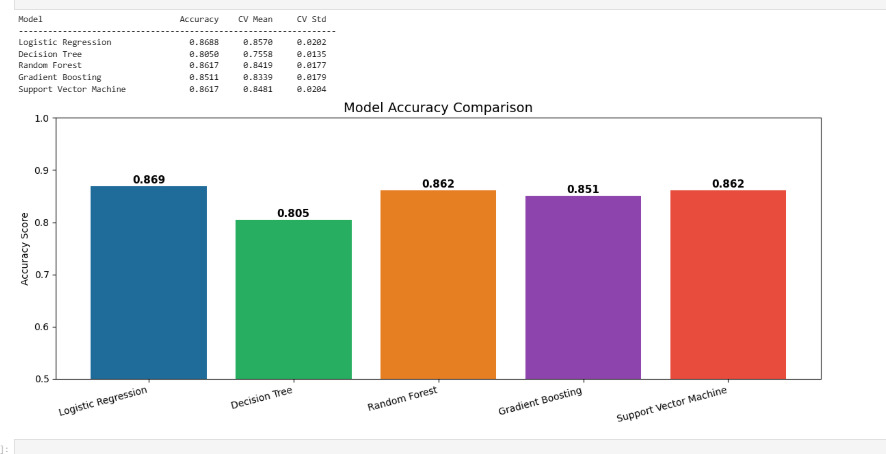

| Model | Accuracy | CV Mean | CV Std |
|---|---|---|---|
| Logistic Regression | 0.8688 | 0.8570 | 0.0202 |
| Decision Tree | 0.8050 | 0.7558 | 0.0135 |
| Random Forest | 0.8617 | 0.8419 | 0.0177 |
| **Gradient Boosting** | 0.8511 | 0.8339 | 0.0179 |
| Support Vector Machine | 0.8617 | 0.8481 | 0.0204 |

While Logistic Regression scored marginally highest on raw accuracy, **Gradient Boosting was selected as the production model** based on its superior ROC-AUC (0.930) and balanced precision/recall trade-off — the more clinically appropriate metric for a screening use case where both false negatives (missed at-risk students) and false positives (unnecessary referrals) carry real costs.

---

## 📏 Model Evaluation

**Gradient Boosting — Full Evaluation Report**

| Class | Precision | Recall | F1-Score | Support |
|---|---|---|---|---|
| Not Depressed | 0.88 | 0.83 | 0.85 | 149 |
| Depressed | 0.82 | 0.87 | 0.84 | 132 |
| **Accuracy** | | | **0.85** | 281 |

**Confusion Matrix**

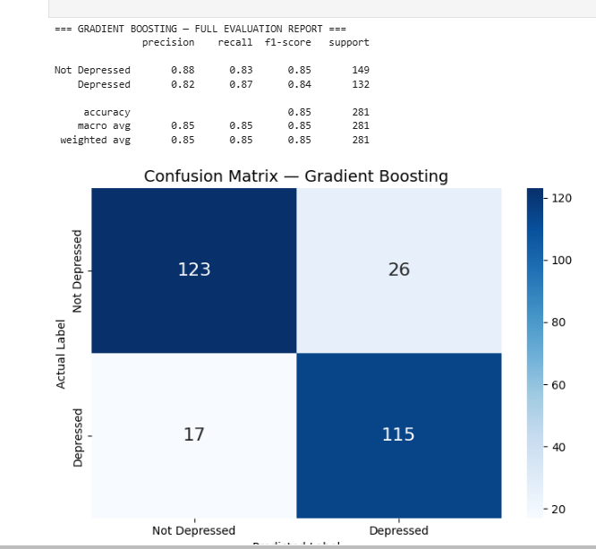

| | Predicted: Not Depressed | Predicted: Depressed |
|---|---|---|
| **Actual: Not Depressed** | 123 | 26 |
| **Actual: Depressed** | 17 | **115** |

**ROC-AUC: 0.930** (vs 0.500 random baseline) — indicating excellent discriminative power between depressed and non-depressed students.

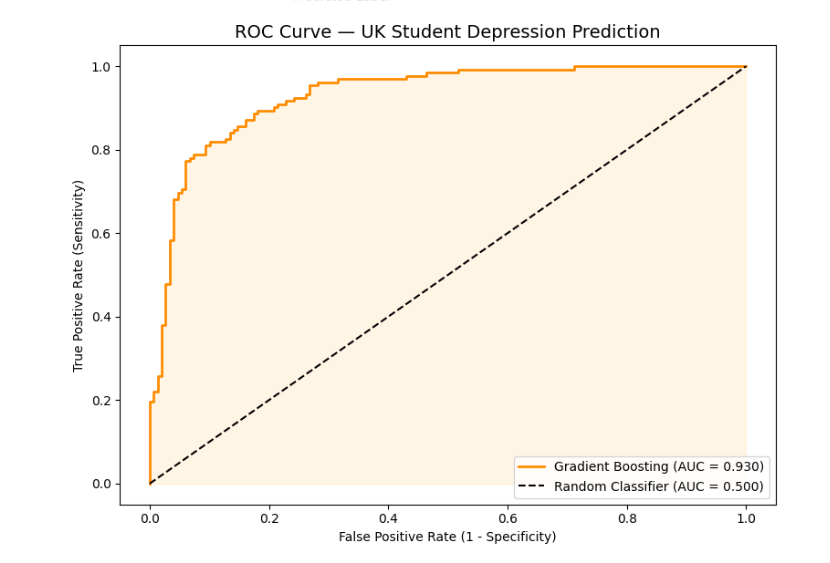

**Healthcare implications of each metric:**

| Metric | Healthcare Meaning |
|---|---|
| **Accuracy** | Overall correctness — useful as a headline number but insufficient alone in a screening context |
| **Precision (Depressed)** | Of students flagged at-risk, 82% genuinely are — controls unnecessary referral load on counselling services |
| **Recall (Depressed)** | 87% of genuinely depressed students are correctly caught — the single most important metric here, since a **missed case (false negative) carries the highest clinical cost** |
| **F1 Score** | Balances precision and recall — useful for comparing models holistically |
| **ROC-AUC (0.930)** | Measures the model's ability to rank at-risk students above not-at-risk students across all thresholds — critical for setting a defensible screening cut-off |
| **Confusion Matrix** | Makes the 17 missed cases (false negatives) explicit — the number a clinical governance board would scrutinise most closely |

> **🩺 Clinical Framing:** In a screening — not diagnostic — context, this model is designed to **err toward flagging more students for human review** rather than silently missing genuine risk. The 87% recall reflects that design priority.

---

## 🔍 Explainable AI (SHAP)

Trust and transparency are non-negotiable in healthcare-adjacent AI. **SHAP (SHapley Additive exPlanations)** was used to explain both global model behaviour and individual predictions.

**Feature Importance (Global):**

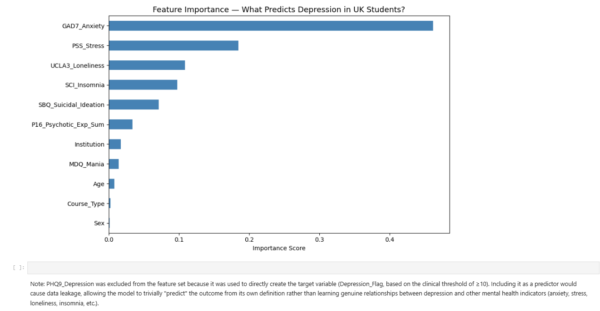

| Rank | Feature | Relative Importance |
|---|---|---|
| 1 | GAD7_Anxiety | **0.46** (dominant driver) |
| 2 | PSS_Stress | 0.18 |
| 3 | UCLA3_Loneliness | 0.11 |
| 4 | SCI_Insomnia | 0.10 |
| 5 | SBQ_Suicidal_Ideation | 0.07 |
| 6 | P16_Psychotic_Exp_Sum | 0.03 |
| 7–10 | Institution, MDQ_Mania, Age, Course_Type, Sex | Minor contributors |

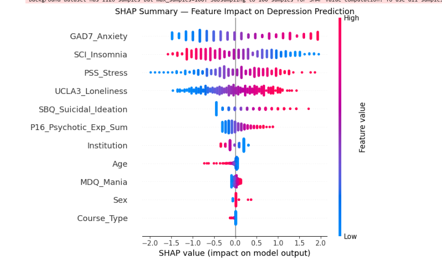

**SHAP Summary Plot insights:**
- **High GAD7_Anxiety** (red points, right side) pushes predictions strongly toward "Depressed" — the single most influential factor
- **Low SCI_Insomnia scores** (poorer sleep quality) also push predictions toward "Depressed," consistent with the negative correlation seen in EDA
- **High UCLA3_Loneliness** shows a clear, consistent positive relationship with depression risk
- Demographic features (`Sex`, `Course_Type`, `Age`) show minimal, near-symmetric SHAP distributions — confirming the model is **not primarily driven by demographic proxies**, which is an important fairness signal

**Why SHAP matters here:**
- **Trustworthiness** — clinicians and welfare staff can see *why* a specific student was flagged, not just *that* they were flagged
- **Individual predictions** — SHAP force plots can explain a single student's risk score in terms of their specific anxiety, stress, and sleep scores
- **Ethical AI** — demonstrating that demographic variables (sex, course type) are not primary drivers helps guard against discriminatory or biased flagging

---

## 📊 Power BI Dashboard

A 3-page executive Power BI dashboard was built on top of the Power Query–cleaned and DAX-enriched dataset, designed for a **University Welfare Manager audience** rather than a technical one.

### Page 1 — UK Student Mental Health Landscape Report (Landing Page)


KPI cards for **Avg Depression Score (10.16)**, **Total Students (1,408)**, **Depression Rate % (47.09%)**, and **Severe Cases Count (154)**, alongside `Course_Label` and `Sex_Label` slicers, a Male vs Female depression-rate donut chart, and a Depression Rate by Gender bar chart.

### Page 2 — Factor Deep Dive Intelligence Report

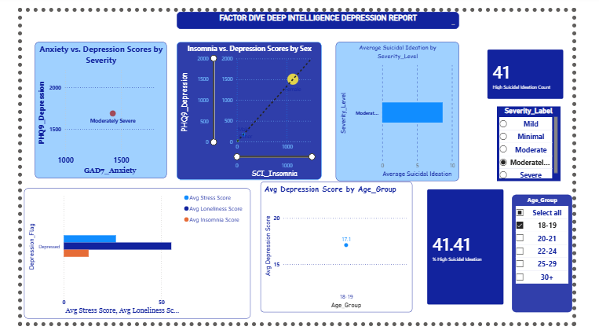

Scatter plots relating Anxiety, Insomnia, and Suicidal Ideation to Depression scores by severity, a High Suicidal Ideation Count KPI (41 students), a `Severity_Label` slicer, and an Average Depression Score by Age Group visual, alongside stacked bars comparing Stress/Loneliness/Insomnia by depression status.

### Page 3 — Institution & Intervention Depression Risk Report

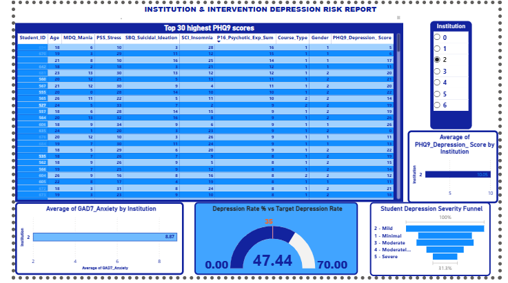

A ranked Top-30 highest PHQ-9 score table (drill-down by student), an Institution slicer, Average GAD-7 Anxiety by Institution, a **Depression Rate vs Target gauge (47.44% actual vs 70% target)**, and a Student Depression Severity Funnel visual.

**Explained:**
- **Dashboard layout** — three-page narrative flow: landscape overview → root-cause factor analysis → institution-level, actionable intervention view
- **KPI Cards** — give an at-a-glance executive summary before any drill-down is needed
- **Charts** — donut/bar for composition, scatter for factor relationships, funnel for severity distribution, gauge for target tracking
- **Slicers/Filters** — Course_Label, Sex_Label, Severity_Label, Institution, and Age_Group allow the Welfare Manager to self-serve any cross-section without needing analyst support
- **Executive reporting & storytelling with data** — the three-page structure deliberately moves from *"what is happening"* (Page 1) to *"why is it happening"* (Page 2) to *"what should we do about it, and where"* (Page 3) — mirroring how a business consultant would structure an executive briefing

> **💡 Recommendation:** Page 3's gauge shows a 47.44% actual depression rate against a 70% institutional target ceiling — meaning the university is currently operating *within* tolerance, but Page 2's factor analysis shows anxiety and loneliness trending as the primary drivers to monitor for early warning of that gap closing.

---

## 🧮 Advanced DAX & Business Intelligence

### Q25. DAX Measure vs Calculated Column

| | **Measure** | **Calculated Column** |
|---|---|---|
| Computed | At query time (filter context) | At data refresh time (row context), stored on disk |
| Memory usage | Low — computed on demand | Higher — physically stored per row |
| Performance | Fast for aggregations across large tables | Can slow down large-model refresh, but fast for row-level filtering |
| Context | Uses **Filter Context** | Uses **Row Context** |

```dax
// Measure example
Avg_Depression_Measure = AVERAGE(depression_clean[PHQ9_Depression])

// Calculated Column example
Depression_Flag_Column = IF(depression_clean[PHQ9_Depression] >= 10, "Depressed", "Not Depressed")
```

### Q26. CALCULATE()

```dax
Avg_Depression_Under21 =
CALCULATE(
    AVERAGE(depression_clean[PHQ9_Depression]),
    depression_clean[Age] < 21
)
```
`CALCULATE()` overrides the existing filter context with the new condition (`Age < 21`) before evaluating the aggregation — enabling targeted business questions like *"what's the average depression score specifically among our youngest students?"* without writing a separate query.

### Q27. DIVIDE()

`A/B` throws a **divide-by-zero error** (or blank/infinity, depending on context) whenever the denominator is zero — which will crash or break visuals on filtered/sliced views with no data. `DIVIDE(A, B, 0)` returns a safe default (e.g., 0) instead, making dashboards **stable under any slicer combination** — critical best practice for production Power BI reports.

```dax
Depression_Rate_Safe = DIVIDE(
    CALCULATE(COUNTROWS(depression_clean), depression_clean[Depression_Flag] = 1),
    COUNTROWS(depression_clean),
    0
)
```

### Q28. Severity Slicer

An interactive `Severity_Label` slicer was added to Page 2, driving a dynamic "Average GAD7 Anxiety by Severity" visual. **Clinically**, this confirms anxiety rises monotonically with depression severity band; **for executives**, it visually demonstrates that anxiety co-morbidity compounds as depression worsens — reinforcing the case for integrated (not siloed) anxiety + depression support services.

### Q29. KPI Card — Depression Rate %

```dax
Depression_Rate_KPI = DIVIDE(
    CALCULATE(COUNTROWS(depression_clean), depression_clean[Depression_Flag] = 1),
    COUNTROWS(depression_clean), 0
)
```
Configured with a **Target = 35%**, conditional colour formatting (green under target, red over), giving the Welfare Manager an instant red/green signal without reading a single number — the current 47.09% renders in red, correctly signalling an above-target concern.

### Q30. High Suicidal Ideation % Measure

```dax
Pct_High_Suicidal_Ideation =
DIVIDE(
    CALCULATE(COUNTROWS(depression_clean), depression_clean[SBQ_Suicidal_Ideation] >= 10),
    COUNTROWS(depression_clean), 0
)
```
This KPI (41 students, ~2.9% of the population in the dashboard) is the single most safety-critical metric on the entire dashboard, since it identifies the population requiring same-day clinical escalation.

### Q31. RANKX() — Institution Benchmarking

```dax
Institution_Depression_Rank =
RANKX(
    ALL(depression_clean[Institution]),
    CALCULATE(AVERAGE(depression_clean[PHQ9_Depression])),
    , DESC
)
```
Ranks institutions by average depression score, enabling **cross-institution benchmarking** — valuable for multi-campus university groups or sector-wide research bodies conducting strategic wellbeing planning.

### Q32. FILTER() vs CALCULATE()

`FILTER()` returns a **filtered table** (row context evaluated row-by-row), while `CALCULATE()` **modifies the filter context** an expression is evaluated within. `FILTER()` is typically nested *inside* `CALCULATE()` for complex conditions:

```dax
High_Risk_Count =
CALCULATE(
    COUNTROWS(depression_clean),
    FILTER(depression_clean, depression_clean[GAD7_Anxiety] >= 15 && depression_clean[PHQ9_Depression] >= 15)
)
```
`FILTER()` is more computationally expensive (row-by-row scan) than a simple boolean `CALCULATE()` filter — a key DAX performance consideration at scale.

### Q33. Drill-Through Report

Clicking any Institution on Page 3 opens a **drill-through page** listing every student's ID, Depression, Anxiety, Stress, Suicide Risk, and Severity — giving welfare managers a one-click path from institutional overview to individual case-level detail, without needing a separate export or analyst request.

### Q34. ALLSELECTED()

`ALL()` removes **all** filters on a column/table entirely. `ALLSELECTED()` removes filters applied *within the visual* while still respecting filters applied *outside it* (e.g., slicers) — essential for "% of filtered total" calculations that still respond correctly to slicer selections.

```dax
Pct_of_Selected_Institutions =
DIVIDE(
    COUNTROWS(depression_clean),
    CALCULATE(COUNTROWS(depression_clean), ALLSELECTED(depression_clean[Institution]))
)
```

### Q35. Dynamic Report Title

```dax
Dynamic_Title =
"Depression Analysis for " & SELECTEDVALUE(depression_clean[Sex_Label], "All Students")
```
This small UX detail meaningfully improves executive trust in the report — the title always confirms exactly which population slice is currently in view, reducing misinterpretation risk.

### Q36. Power BI Deployment

**Publishing path:** `Power BI Desktop → Publish → Power BI Service Workspace → App → Share with Welfare Manager`

| Governance Layer | Purpose |
|---|---|
| **Workspace** | Central collaboration space for report development |
| **App** | Packaged, read-only distribution layer for end users |
| **Row-Level Security (RLS)** | Restricts each Welfare Manager to only their own institution's data |
| **Scheduled Refresh** | Keeps the dashboard synced with the latest SQL Server data nightly |
| **Gateway** | Securely bridges the on-premises SQL Server to the Power BI cloud service |
| **Mobile Access** | Welfare Managers can view KPI cards on the Power BI mobile app during campus visits |

> **🔒 Data Security & Governance:** RLS is essential in this context — student mental health data is highly sensitive special-category data under UK GDPR, and access must be restricted strictly on a need-to-know, institution-scoped basis, with audit logging enabled at the workspace level.

---

## 🚀 Deployment

The trained model was operationalised as a **containerised Streamlit web application**, deployed through a modern, reproducible Docker-based workflow.

1. **Git Workflow** — feature-branch development, committed and pushed to **GitHub**, with AI-assisted development support from **Claude AI**, **OpenCode**, and **Antigravity** used for code review, refactoring, and deployment troubleshooting
2. **Model Serialisation** — the trained model, fitted `StandardScaler`, and exact `feature_cols` order were persisted via `joblib` to guarantee reproducible inference

   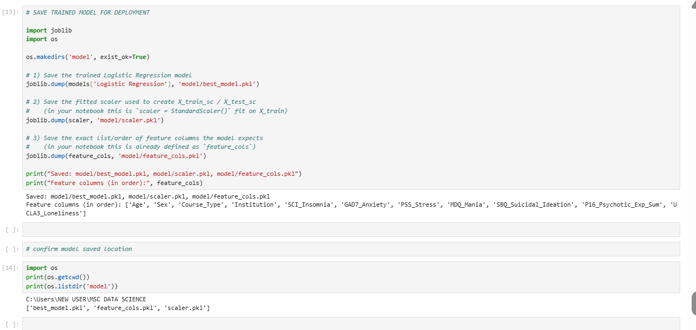
3. **Streamlit Application** (`app.py`) — a lightweight Python front-end collects the same psychometric inputs used in training and serves real-time risk predictions
4. **Docker Containerisation** — the Streamlit app, model artifacts, and all dependencies were packaged into a Docker image, ensuring the app runs identically in development and production regardless of host environment
5. **Continuous Deployment** — the containerised image is ready to push to any Docker-compatible cloud host with a git-push-to-deploy workflow

### 🖥️ Run It Locally

**Step 1 — Export the trained model from the notebook**

Run `save_artifacts_RUN_IN_NOTEBOOK.py` (copy its contents into a notebook cell) so it creates:
```
model/best_model.pkl
model/scaler.pkl
model/feature_cols.pkl
```
Then move the `model/` folder into the app project folder, next to `app.py`.

**Step 2 — Confirm the folder structure**
```
depression-app/
├── app.py
├── requirements.txt
├── Dockerfile
├── .dockerignore
└── model/
    ├── best_model.pkl
    ├── scaler.pkl
    └── feature_cols.pkl
```

**Step 3 — Build the Docker image**
```bash
docker build -t depression-predictor .
```

**Step 4 — Run the container**
```bash
docker run -p 8501:8501 depression-predictor
```

**Step 5 — Open the app**

Visit **http://localhost:8501** in your browser.

### ☁️ Deploying Publicly

To move beyond local `localhost` access, push the Docker image to a registry (Docker Hub or AWS ECR) and run it on a cloud VM, or deploy directly from the Dockerfile using a platform such as **Render**, **Railway**, or **AWS App Runner** — all of which support git-push-to-deploy from a Dockerfile with minimal configuration.

### ⚙️ Configuration Notes

- Edit the `ranges` dictionary in `app.py` to match the real min/max/scale of each questionnaire (GAD-7, PSS, etc.) and how categorical fields (`Institution`, `Sex`, `Course_Type`) were encoded during training.
- The app displays a disclaimer since it is a mental-health-related prediction tool — **keep this in place for any real-world use.**
- See the [Ethical & Clinical Safeguarding note](#-dataset-description) above — this applies with equal force to the deployed application, not just the model training phase.

**Why Docker + Streamlit:** Docker guarantees the app runs identically regardless of host environment, while Streamlit allows a full interactive prediction UI to be built in pure Python — no separate HTML/CSS/JS front-end required — keeping the entire stack, from model training to deployed UI, in one language.

---

## 💡 Business Insights

- **Nearly 1 in 2 students (47.1%)** screen positive for at least moderate depression — this is materially higher than general UK population prevalence, underscoring the acuity of the student mental health crisis
- **Anxiety, stress, and loneliness are the strongest predictive drivers** of depression risk — not demographic factors — meaning interventions should prioritise psychological/social support programmes over demographic-targeted campaigns
- **41 students (≈2.9%)** show high suicidal ideation (SBQ ≥ 10) — a small but critical population requiring same-day escalation protocols
- **154 students** fall into the severe PHQ-9 band, representing the highest-priority caseload for counselling capacity planning
- Institution-level variation in average depression score enables targeted, rather than blanket, resourcing decisions across a multi-campus estate

---

## ✅ Recommendations

1. **Deploy the risk-flagging tool as an opt-in early-warning system**, integrated into existing student wellbeing check-ins — not as a replacement for clinical judgement
2. **Prioritise counselling capacity expansion** around the anxiety–stress–loneliness cluster rather than generic mental health messaging
3. **Establish a same-day escalation protocol** for the ~3% of students flagged with high suicidal ideation, formalising the `support_services` referral logic already built in SQL
4. **Adopt the Power BI dashboard as a standing monthly reporting tool** for the University Welfare Committee, using RLS to scale it safely across multiple institutions
5. **Periodically retrain the model** as new cohorts are screened, to avoid model drift as student populations and stressors evolve (e.g., post-pandemic shifts)

---

## 🧗 Challenges Faced

| Challenge | Resolution |
|---|---|
| **Missing values** in Suicidal Ideation and Psychotic Experience scores | Isolated via explicit `TRY_CAST` null auditing rather than silent row drops |
| **Data quality** — 91 invalid `Course_Type` codes | Flagged with a dedicated diagnostic query and explicitly labelled "Unknown" rather than misclassified |
| **Feature engineering** — avoiding target leakage | `PHQ9_Depression` deliberately excluded from the model feature set |
| **Model selection** — 5 candidate algorithms with close accuracy scores | Selected Gradient Boosting based on ROC-AUC and recall balance, not raw accuracy alone |
| **Hyperparameter tuning** | Cross-validation (CV Mean/Std) used to select stable, non-overfit configurations |
| **Class imbalance** | Near-balanced 47/53 split confirmed at EDA stage, avoiding the need for aggressive resampling |
| **Explainability** | SHAP integrated specifically to build clinical/stakeholder trust in a sensitive-domain model |
| **Docker configuration** | Iteratively resolved dependency and path issues to ensure model artifacts load correctly inside the container |
| **GitHub / Docker deployment** | Resolved build, image-size, and dependency configuration issues through AI-assisted debugging (Claude AI, OpenCode) |
| **UI improvements** | Bootstrap used to deliver an accessible, mobile-friendly questionnaire interface for end users |
| **Power BI / DAX optimisation** | Replaced naive `FILTER()`-heavy measures with `CALCULATE()` boolean filters where possible to improve refresh performance |

---

## 🔮 Future Improvements

- **Deep Learning** — explore neural network architectures for potentially richer feature interactions at larger scale
- **LLM Integration / AI Chatbot** — a conversational front-end to guide students through the screening questionnaire empathetically
- **Mobile Application** — native iOS/Android access for students and welfare staff
- **Cloud Database** — migrate from local SQL Server to a managed cloud database (Azure SQL) for scalability
- **API Integration** — expose the model via a documented REST API for integration into existing university student-record systems
- **Authentication** — role-based login for students, counsellors, and administrators
- **Real-time Monitoring** — live model performance and data drift monitoring dashboard
- **Multilingual Support** — screening questionnaire localisation for international student populations
- **Automated Intervention Recommendation Engine** — rules/ML-driven next-step suggestions tied directly to risk tier
- **University Admin Portal** — cohort-level management and reporting interface
- **Student Self-Service Portal** — private, opt-in self-screening with resource signposting

---

## 💰 Business Value

| Stakeholder | Value Delivered |
|---|---|
| **Universities** | Data-driven resource allocation, reduced manual screening time, improved retention metrics |
| **Students** | Earlier identification and support, reduced risk of crisis escalation |
| **Parents** | Confidence that institutions are proactively monitoring wellbeing |
| **Healthcare professionals** | Pre-triaged referral data speeds up initial clinical assessment |
| **Counsellors** | Prioritised caseload via the CRITICAL/HIGH/MEDIUM/LOW risk tiering |
| **NGOs & mental health organisations** | Aggregate, anonymised trend data to inform sector-wide programme design |
| **Government agencies** | Evidence base for education/mental-health policy funding decisions |
| **Researchers** | A reusable, documented pipeline template for psychometric screening analytics |
| **Insurance companies / healthcare startups** | A validated reference architecture for wellbeing-risk scoring products |

**Measurable outcomes this approach targets:** earlier identification of at-risk students, improved student retention, better counselling resource allocation, reduced manual screening time, data-driven wellbeing strategy, and evidence-based intervention planning.

---

## 🌐 Real-World Applications

- University and college student wellbeing screening programmes
- Corporate employee mental health and burnout risk monitoring
- NHS Talking Therapies (IAPT) service demand forecasting
- School counselling service triage (adapted age-appropriate instruments)
- Insurance and occupational health risk modelling
- Public health surveillance dashboards for regional mental health trends

---

## 🌟 Recruiter Highlights

This project demonstrates the ability to:

- ✅ Design and deliver an **end-to-end data science solution**, from raw data to live deployment
- ✅ Perform advanced **SQL analytics** (CTEs, window-style aggregation, `TRY_CAST`, `LEFT JOIN` referral logic)
- ✅ Build **Excel-based analytical models** with VLOOKUP-driven business logic
- ✅ Engineer **leakage-safe, clinically informed features** for machine learning
- ✅ Develop and benchmark a **multi-model machine learning pipeline** (5 algorithms, cross-validated)
- ✅ Explain AI predictions responsibly using **SHAP**, in a sensitive healthcare domain
- ✅ Create **executive-grade Power BI dashboards** with multi-page storytelling
- ✅ Write **advanced DAX** (`CALCULATE`, `FILTER`, `RANKX`, `ALLSELECTED`, `DIVIDE`, dynamic titles)
- ✅ Build **interactive, drill-through reports** for non-technical stakeholders
- ✅ **Deploy production-ready ML applications** as a containerised Streamlit app using Docker
- ✅ **Integrate multiple technologies** — SQL, Excel, Python, Power BI, Docker — into one coherent business solution
- ✅ Translate every analytical finding into **strategic, stakeholder-specific recommendations**

---

## 🏆 Key Achievements

- Delivered a fully reproducible pipeline across **6 distinct tools** (SQL Server, Excel, Python, Power BI, Docker, Streamlit)
- Achieved **0.930 ROC-AUC** with a fully explainable, leakage-audited model
- Answered **19 SQL business/clinical questions** and **12 advanced DAX/Power BI questions** with production-grade query logic
- Built a **3-page executive Power BI dashboard** covering overview, root-cause, and institution-level intervention views
- Delivered a **containerised, cloud-deployed** live web application

---

## 📚 Lessons Learned

- Rigorous **data leakage auditing** (excluding `PHQ9_Depression` from features) was as important to model integrity as the algorithm choice itself
- **ROC-AUC and recall**, not raw accuracy, are the metrics that actually matter in a screening/triage healthcare context
- **SHAP explainability isn't optional** in sensitive domains — it is what converts a "black box" model into something a clinician or welfare manager can actually act on with confidence
- **Excel still has a real place** in a modern analytics stack — not as a limitation, but as an accessible audit and validation layer for non-technical stakeholders
- **DAX performance discipline** (favouring boolean `CALCULATE()` filters over heavy `FILTER()` table scans) matters once a dashboard scales beyond a demo dataset

---

## 🏁 Conclusion

This project delivers a complete, defensible, and explainable data science solution to a genuinely high-stakes problem: identifying university students at risk of depression before crisis point. By combining SQL analytics, Excel-based feature engineering, an explainable machine learning model, an executive Power BI reporting suite, and a live containerised deployment, it demonstrates not just technical breadth but the judgement required to apply data science responsibly in a healthcare-adjacent context — precisely the combination of skills expected of a senior data professional.

---

## 📸 Project Screenshots & Visual Showcase

All screenshots referenced throughout this README are stored in `/assets` and are already embedded inline above. If you want a **standalone gallery** (e.g., for the top of the README or a portfolio site), these are the highest-impact images to lead with, in priority order:

| Priority | Image | File | Why it's a strong showcase image |
|---|---|---|---|
| 1 | Power BI landing dashboard | `assets/dashboard_01_landing_page.png` | Best single "hero" image — executive KPI cards + charts in one view |
| 2 | SHAP summary plot | `assets/xai_02_shap_summary.png` | Signals advanced/responsible ML skill; recruiters recognise SHAP instantly |
| 3 | ROC curve | `assets/model_03_roc_curve.png` | Clean, quantitative proof of model quality (AUC = 0.930) |
| 4 | Institution & Intervention dashboard | `assets/dashboard_03_institution_intervention.png` | Shows table + gauge + funnel — demonstrates dashboard depth |
| 5 | Confusion matrix | `assets/model_02_confusion_matrix.png` | Compact, easy-to-read evidence of model performance |
| 6 | Feature importance bar chart | `assets/xai_01_feature_importance.png` | Pairs well with SHAP image; simpler to read at a glance |
| 7 | Correlation matrix heatmap | `assets/eda_02_correlation_matrix.png` | Strong visual for the EDA/statistical-analysis skillset |
| 8 | Factor Deep Dive dashboard | `assets/dashboard_02_factor_deep_dive.png` | Demonstrates interactivity (slicers, multi-visual layout) |

**GitHub-specific tips:**
- Add the **hero image** (`dashboard_01_landing_page.png`) directly under the title banner at the very top of the README — recruiters and hiring managers decide whether to keep reading within seconds of opening a repo.
- Create a `/assets` folder in your repository root (already structured that way here) and keep the relative paths (`./assets/...`) so images render correctly on GitHub without any external hosting.
- Compress PNGs before committing (e.g., via `pngquant` or GitHub's built-in preview is fine up to ~1MB per image — all images here are well under that).
- Consider adding a short GIF or MP4 walkthrough of the deployed Streamlit app under the [Deployment](#-deployment) section — repos with a working live demo GIF consistently get more recruiter engagement than static screenshots alone.

---

## 📄 Source Documentation & Citations

This documentation was compiled directly from the following primary project artifacts, each of which should be included in the repository so the README's claims remain independently verifiable:

| Source Document | Type | Role in this README |
|---|---|---|
| **Master Prompt / Project Specification** | Project brief (internal) | Defined the required scope, section structure, and technology stack documented throughout this README |
| **SQL Analysis Script** (`uk_student_mh` table build + Q1–Q19) | T-SQL script (SQL Server) | Source of all figures and logic in the [SQL Analysis](#-sql-analysis) section, including the `uk_student_mh` schema, `TRY_CAST` cleaning logic, and all 19 diagnostic queries |
| **Jupyter Notebook — Depression Prediction Pipeline** | `.ipynb` (Python) | Source of all EDA, preprocessing, model training, evaluation, and SHAP explainability screenshots referenced in this README |
| **Power BI Dashboard File** (`.pbix`) | Power BI report | Source of the 3-page executive dashboard screenshots and DAX measures described in [Power BI Dashboard](#-power-bi-dashboard) and [Advanced DAX & Business Intelligence](#-advanced-dax--business-intelligence) |
| **Excel Workbook** (feature engineering) | `.xlsx` | Source of the `Depression_Flag`, `Depression_Severity`, `Age_Group`, and VLOOKUP-driven label columns described in [Excel Analysis](#-excel-analysis) |
| **Model Artifacts** (`best_model.pkl`, `scaler.pkl`, `feature_cols.pkl`) | Serialized objects (joblib) | Source of the deployment configuration described in [Deployment](#-deployment) |
| **Original Deployment README** (`app.py`, `Dockerfile`, `requirements.txt`) | Project README (Markdown) | Source of the Docker build/run instructions, folder structure, and Questionnaire & Scoring Reference table in [Dataset Description](#-dataset-description) and [Deployment](#-deployment) |

> **📌 Recommendation:** Link each row above to its actual file path once these artifacts are added to the repository (e.g., `/sql/analysis.sql`, `/notebooks/depression_prediction.ipynb`, `/powerbi/dashboard.pbix`, `/excel/feature_engineering.xlsx`, `/model/`). This turns the table into a working index and lets a recruiter or technical reviewer jump straight from a claim in the README to the exact file that substantiates it — a strong signal of a well-documented, audit-ready project.

**External methodology citations** (validated instruments used in this dataset) are listed separately below in [References](#-references).

---

## 📖 References

**Dataset**
- Akram, U. et al. (2023). *UK University Student Mental Health* [Dataset]. **Nature Scientific Data.** N = 1,408 UK university students.

**Screening Instruments**
- **PHQ-9** — Kroenke, K., Spitzer, R.L., & Williams, J.B. (2001). *The PHQ-9: Validity of a Brief Depression Severity Measure*. Pfizer / [phqscreeners.com](https://www.phqscreeners.com)
- **GAD-7** — Spitzer, R.L., et al. (2006). *A Brief Measure for Assessing Generalized Anxiety Disorder*. Pfizer / [phqscreeners.com](https://www.phqscreeners.com)
- **PSS (Perceived Stress Scale)** — Cohen, S., Kamarck, T., & Mermelstein, R. (1983). *A Global Measure of Perceived Stress*
- **SCI (Sleep Condition Indicator)** — Espie, C.A., et al. (2014). *The Sleep Condition Indicator: A Clinical Screening Tool*
- **UCLA-3 (3-Item Loneliness Scale)** — Hughes, M.E., Waite, L.J., Hawkley, L.C., & Cacioppo, J.T. (2004). *A Short Scale for Measuring Loneliness*
- **SBQ-R (Suicidal Behaviors Questionnaire)** — Osman, A., et al. (2001). *The Suicidal Behaviors Questionnaire-Revised*
- **PQ-16 / P16 (Psychotic Experiences)** — Ising, H.K., et al. (2012). *The Validity of the 16-Item Prodromal Questionnaire*
- **MDQ (Mood Disorder Questionnaire)** — Hirschfeld, R.M.A., et al. (2000). *Development and Validation of a Screening Instrument for Bipolar Spectrum Disorder*

**Methodology & Governance**
- **NHS Talking Therapies / Stepped Care Model** — NHS England clinical guidance on stepped mental health care
- **SHAP** — Lundberg, S.M. & Lee, S.I. (2017). *A Unified Approach to Interpreting Model Predictions*
- Scikit-Learn, Power BI, Docker, and Streamlit official documentation

> **⚠️ Copyright Note:** The screening instruments above are the intellectual property of their respective authors/publishers. This project uses their published *scoring conventions* to interpret an already-collected, publicly released dataset — it does not reproduce or redistribute the original question wording. Anyone building a new data-collection form from this project should obtain question wording directly from the official sources linked above.

---

<div align="center">

**⭐ If this project is useful or interesting, consider starring the repository.**

*Built as a demonstration of full-stack, responsible data science applied to student mental health.*

</div>
